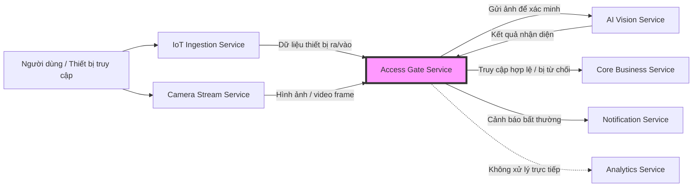

# Service Boundary: Access Gate Service (Dịch vụ kiểm soát ra/vào)

## 1. Thông tin nhóm

- Tên nhóm: [Tên nhóm của bạn]
- Lớp: [Lớp của bạn]
- Service nhóm phụ trách: **Access Gate Service (A3/B3)**
- Đề tài: Xây dựng dịch vụ kiểm soát ra/vào.

## 2. Actor (Đối tượng tương tác)

- **Nhân viên / Cư dân**: Người cần thực hiện việc ra/vào qua cổng.
- **Khách**: Người đăng ký ra vào tạm thời.
- **Nhân viên bảo vệ**: Giám sát và xử lý các tình huống cổng không tự động mở.
- **Hệ thống tự động (IoT)**: Các cảm biến và đầu đọc thẻ tại cổng.

## 3. System Boundary (Phạm vi hệ thống)

### Phần nhóm kiểm soát:
- Logic xác thực quyền ra vào (Access Control Logic).
- Quản lý trạng thái các cổng (Gate Status Management).
- Xử lý các quy tắc (Rules) cho phép hoặc từ chối dựa trên định danh.
- Lưu trữ lịch sử ra vào tạm thời trước khi đồng bộ về Analytics.

### Phần nhóm chỉ tích hợp:
- **IoT Ingestion**: Tích hợp với phần cứng (Reader, Motor) qua service trung gian.
- **AI Vision**: Nhận kết quả nhận diện khuôn mặt/biển số xe.
- **Core Business**: Lấy danh sách nhân sự và lịch trình cho phép.

## 4. Service Boundary (Trách nhiệm của Service)

### Service CÓ trách nhiệm:
- Nhận diện yêu cầu ra vào từ các nguồn (Thẻ, Khuôn mặt, Biển số).
- Kiểm tra tính hợp lệ của yêu cầu dựa trên quy tắc từ Core Business.
- Gửi lệnh điều khiển mở/đóng cổng.
- Ghi nhận và báo cáo các sự cố tại cổng (Kẹt cổng, xâm nhập trái phép).

### Service KHÔNG làm gì:
- Không trực tiếp quản lý hồ sơ nhân sự (do Core Business quản lý).
- Không trực tiếp phân tích hình ảnh (do AI Vision quản lý).
- Không trực tiếp lưu trữ video stream (do Camera Stream quản lý).

## 5. Input / Output

### Input (Lấy dữ liệu từ)
- **IoT Ingestion**: Tín hiệu từ đầu đọc thẻ (Card ID), cảm biến hồng ngoại.
- **AI Vision**: Thông tin định danh từ khuôn mặt hoặc biển số xe.
- **Core Business**: Quy định quyền truy cập (Access Rules), danh sách đen (Blacklist).

### Output (Trả dữ liệu cho)
- **IoT Ingestion**: Lệnh mở cổng (Open Gate Command), lệnh đóng cổng, còi báo động.
- **Notification**: Gửi thông báo khi có người lạ xâm nhập hoặc VIP đến.
- **Analytics**: Dữ liệu nhật ký ra vào để tổng hợp báo cáo chuyên sâu.
- **Core Business**: Cập nhật trạng thái điểm danh hoặc vị trí hiện tại của nhân sự.

## 6. API dự kiến (Thiết kế mẫu)

| Method | Endpoint | Mục đích |
|---|---|---|
| POST | /gate/request-access | Nhận yêu cầu ra vào từ IoT/AI |
| GET | /gate/{id}/status | Kiểm tra trạng thái hiện tại của cổng |
| POST | /gate/{id}/command | Gửi lệnh điều khiển cổng thủ công |
| GET | /gate/history | Xem lịch sử ra vào gần đây |

## 7. Phụ thuộc service khác

### Service này gọi đến:
- **Core Business**: Kiểm tra quyền truy cập của User.
- **IoT Ingestion**: Gửi lệnh vật lý tới thiết bị.
- **Notification**: Gửi cảnh báo khi có sự cố.
- **Analytics**: Đẩy dữ liệu log ra vào.

### Service khác gọi đến service này:
- **IoT Ingestion**: Đẩy dữ liệu từ đầu đọc thẻ.
- **AI Vision**: Đẩy kết quả nhận diện định danh.
- **Core Business**: Cập nhật cấu hình hoặc danh sách quyền truy cập mới.

## 8. Sơ đồ minh họa (Mermaid)

