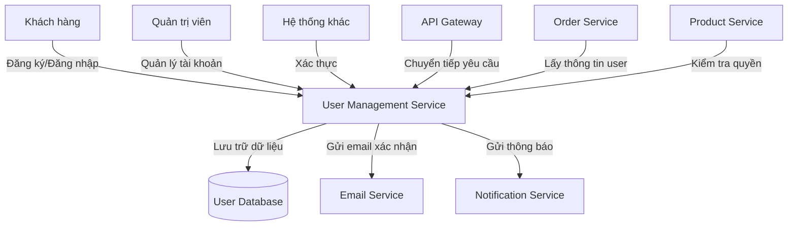

# Service Boundary của nhóm

## 1. Thông tin nhóm

- Tên nhóm: Nhóm 4
- Lớp: CNTT17-13
- Thành viên:
Đào Anh Dũng
Trần Hiếu Nghĩa
Bùi Khương Duy
Trần Hải Nam
- Service nhóm phụ trách: User Management Service
- Sản phẩm tổng thể của lớp: Hệ thống microservices cho nền tảng thương mại điện tử

## 2. Actor

Ai tương tác với hệ thống/service?

- Khách hàng (Customers): Đăng ký tài khoản, đăng nhập, cập nhật thông tin cá nhân
- Quản trị viên (Admins): Quản lý tài khoản người dùng, xem báo cáo
- Hệ thống khác (Other Services): Gọi API để xác thực người dùng

## 3. System Boundary

Nhóm em xây phần nào?

Phần nhóm kiểm soát:

- Cơ sở dữ liệu người dùng (User Database)
- Logic xử lý đăng ký và xác thực
- API endpoints cho quản lý người dùng

Phần nhóm chỉ tích hợp:

- Dịch vụ gửi email (Email Service) để gửi xác nhận đăng ký
- Dịch vụ thanh toán (Payment Service) để liên kết tài khoản

## 4. Service Boundary

Service của nhóm có trách nhiệm gì?

- Quản lý thông tin tài khoản người dùng (tạo, đọc, cập nhật, xóa)
- Xác thực và ủy quyền người dùng
- Phát hành và xác minh token JWT

Service KHÔNG làm gì?

- Không xử lý thanh toán trực tiếp
- Không gửi email marketing
- Không quản lý sản phẩm hoặc đơn hàng

## 5. Input / Output

### Input

- Thông tin đăng ký người dùng (username, email, password)
- Token xác thực cho các yêu cầu API
- Dữ liệu cập nhật hồ sơ người dùng

### Output

- Thông tin người dùng (JSON response)
- Token JWT sau khi đăng nhập thành công
- Mã lỗi cho các trường hợp thất bại

## 6. API dự kiến

| Method | Endpoint | Mục đích |
|---|---|---|
| GET | /health | Kiểm tra trạng thái service |
| POST | /users | Tạo tài khoản người dùng mới |
| GET | /users/{id} | Lấy thông tin người dùng theo ID |
| PUT | /users/{id} | Cập nhật thông tin người dùng |
| DELETE | /users/{id} | Xóa tài khoản người dùng |
| POST | /auth/login | Đăng nhập và nhận token |
| POST | /auth/logout | Đăng xuất và hủy token |

## 7. Phụ thuộc service khác

Service này gọi đến service nào?

- Email Service: Để gửi email xác nhận đăng ký
- Notification Service: Để gửi thông báo đẩy

Service nào gọi đến service này?

- API Gateway: Chuyển tiếp các yêu cầu từ client
- Order Service: Để lấy thông tin người dùng cho đơn hàng
- Product Service: Để kiểm tra quyền truy cập sản phẩm

## 8. Sơ đồ minh họa

Có thể vẽ bằng Mermaid, draw.io, Ludichart hoặc ảnh chụp sơ đồ.

